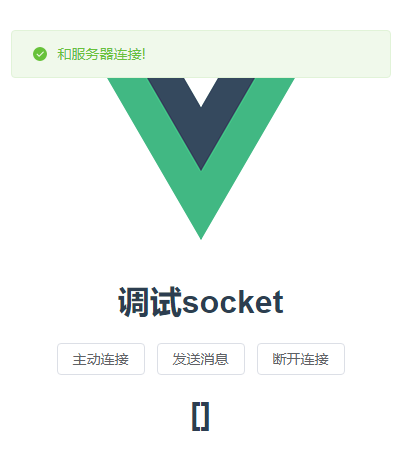

本项目由服务端和客户端构成

服务端是由ts写的，所以启动服务端要用ts-node，所以先确保安装了ts-node

```
npm i ts-node -g
```

然后启动服务端

```
ts-node server/app.ts
```

启动后，就可以启动客户端

```
npm run watch
```

能看到和服务器建立连接，就说明启动成功了。

也可以将其打包，启动打包后的构建产物，查看是否运行成功

```
npm run compile
```

到dist/win-unpacked目录启动项目



