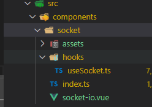
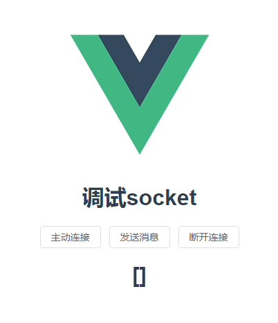

socket-electron需要搭建后端服务。

首先是后端服务器的搭建

# socket.io后端服务搭建

先了解socket.io的两个重要的api

### socket.on

socket.on用来监听事件的触发，比如有人触发了连接服务器，有人触发了断开连接服务器，触发了发送消息事件等等。监听到后，就可以进行相对应的数据处理。

### socket.emit

socket.emit用来派发事件，比如定义了一个事件，然后在某些时机派发出去，其他端就能通过socket.on监听到，并处理相对应的逻辑。


## 搭建步骤

先创建server.ts文件。然后导出socket.io里面的服务器，有点类似于express，然后设置允许跨域，因为前端访问socket时，会出现跨域，所以需要允许跨域。

```js
import { Server } from "socket.io";
const io = new Server({ cors: { origin: "*" } });
```

然后就可以通过socket.on来监听连接事件了connection或者connect，所有的逻辑都是在connection里面处理的。并接收socket的实例对象。可以打印出每个连接socket.io的id

```js
io.on("connection", (socket: any) => {
  console.log(`connect ${socket.id}`);
});
```

再在connection事件里面定义一个客户端断开连接的事件，disconnect，当客户端断开连接的时候监听断开连接的事件，并且派发已经断开连接的事件disconnected，也可以打印客户端连接的id。

```js
io.on("connection", (socket: any) => {
  console.log(`connect ${socket.id}`);
    
      //监听disconnect事件
  socket.on("disconnect", () => {
    //逻辑处理
   console.log(`客户端离开页面 ${socket.id}`);
  });
});
```

可以定义一个send事件，当客户端向服务端派发send事件的时候，监听到send事件，则派发responde事件，并把数据传过去。

```js
let a = 1;  
socket.on("send", (data: any) => {
    console.log("接收到客户端的消息", data);
    setTimeout(() => {
      socket.emit("response", { data: a });
      a++;
    }, 0);
  });
```

最后设置监听4000端口

```js
io.listen(4000);
```


## 参考例子（可以直接复制过去）

```js
//server.ts

import { Server } from "socket.io";

let a = 1;
const io = new Server({ cors: { origin: "*" } });

io.on("connection", (socket: any) => {
  console.log(`connect ${socket.id}`);

  //监听disconnect事件
  socket.on("disconnect", () => {
    //逻辑处理
    console.log(`客户端离开页面 ${socket.id}`);
  });

  socket.on("send", (data: any) => {
      
    console.log("接收到客户端的消息", data);
      
      //延时返回数据
    setTimeout(() => {
      socket.emit("response", { data: a });
      a++;
    }, 0);
  });
});

io.listen(4000);
```


# electron前端搭建

客户端可以用的api和后端搭建的基本一致，也是socket.on和socket.emit，只不过多了个socket.connect连接服务端，socket.disconnect断开连接和socket.open重新连接。

与服务端不一样，socket实例的是从socket.io-client这个包里面导出来的。

### socket.connect()

### socket.disconnect()

### socket.open()

基于electron-vite-builder这个框架搭建的项目：[cawa-93/vite-electron-builder: Secure boilerplate for Electron app based on Vite. TypeScript + Vue/React/Angular/Svelte/Vanilla (github.com)](https://github.com/cawa-93/vite-electron-builder)

首先是克隆仓库

## useSocket hooks搭建

目录结构



然后先创建个hooks文件夹，在里面创建一个useSocket.ts的文件，写上连接的逻辑，以及处理和接收的信息。

先从socket.io-client中导出io这个成员来连接服务端，并且生成实例返回出去给组件使用。

```js
//hooks/useSocket.ts

import { io } from "socket.io-client";
const socket = io("ws://localhost:4000/", {});

export default socket;
```

然后监听连接成功，并打印信息

```js
socket.on("connect", () => {
  console.log("和服务器连接");
});
```

## 参考例子（可以直接复制过去）

```js
//hooks/useSocket.ts

import { io } from "socket.io-client";
const socket = io("ws://localhost:4000/", {});

socket.on("connect", () => {
  console.log("和服务器连接");
});

export default socket;
```

## 前端页面搭建

因为会利用到element-plus，所以要提前下载好，并配置好。



然后创建一个socket.vue的组件，在组件内编写。

页面设置设置三个按钮，重新连接/主动连接，发送消息，和断开连接。

再分别绑定对应的触发函数，connect，send，disconnect。

再定义一个message数组，放在页面上，用来展示接收到的数据。

```vue
<template>
  <h1>调试socket</h1>
  <el-button @click="connect"> 主动连接 </el-button>
  <el-button @click="send"> 发送消息 </el-button>
  <el-button @click="disconnect"> 断开连接 </el-button>
  <h1>{{ message }}</h1>
</template>
```

```js
import { ref } from "vue";
let message = ref([]);
```


设置当一进入首页时就连接上服务端

```js
import socket from "./hooks/useSocket";
socket.connect();
```

当点击发送消息时，则触发send函数，并向服务器派发send事件

```js
function send() {
  socket.emit("send", { age: 17 });
}
```

由于服务端已经定义好了监听send事件，当客户端向服务端派发的时候，服务端会监听到，并向客户端派发response事件，并且携带数据。

所以我们也要在客户端定义好监听response事件，直接使用从hooks/useSocket.ts中导出来的实例，接收到信息，并push到数组中。

```js
socket.on("response", (data: string) => {
  console.log(data);
  (message.value as string[]).push(data);
});
```

当点击断开时，就定义一个断开的函数，并且socket.disconnect()这个api断开连接

```js
const disconnect = () => {
  socket.disconnect();
  console.log("断开连接");
  ElMessage({
    message: "断开连接",
    type: "error",
  });
};
```

断开连接之后，要重新与服务器建立连接，则使用socket.open()这个api

```js
const connect = () => {
  socket.open();
  console.log("重新连接服务器");
  ElMessage({
    message: "重新连接服务器",
    type: "success",
  });
};
```

## 参考例子（可以直接复制过去）

```vue
<template>
  <h1>调试socket</h1>
  <el-button @click="connect">
    主动连接
  </el-button>
  <el-button @click="send">
    发送消息
  </el-button>
  <el-button @click="disconnect">
    断开连接
  </el-button>
  <h1>{{ message }}</h1>
</template>

<script setup lang="ts">
import { ref } from 'vue';
import socket from './hooks/useSocket';
import { ElMessage } from 'element-plus';
socket.connect();
let message = ref([]);
socket.on('response', (data: string) => {
  console.log(data);
  (message.value as string[]).push(data);
});

function send() {
  socket.emit('send', { age: 17 });
}
const disconnect = () => {
  socket.disconnect();
  console.log('断开连接');
  ElMessage({
    message: '断开连接',
    type: 'error',
  });
};
const connect = () => {
  socket.open();
  console.log('重新连接服务器');
  ElMessage({
    message: '重新连接服务器',
    type: 'success',
  });
};
</script>

<style>
#app {
  font-family: Avenir, Helvetica, Arial, sans-serif;
  -webkit-font-smoothing: antialiased;
  -moz-osx-font-smoothing: grayscale;
  text-align: center;
  color: #2c3e50;
  margin-top: 60px;
}
</style>

```

